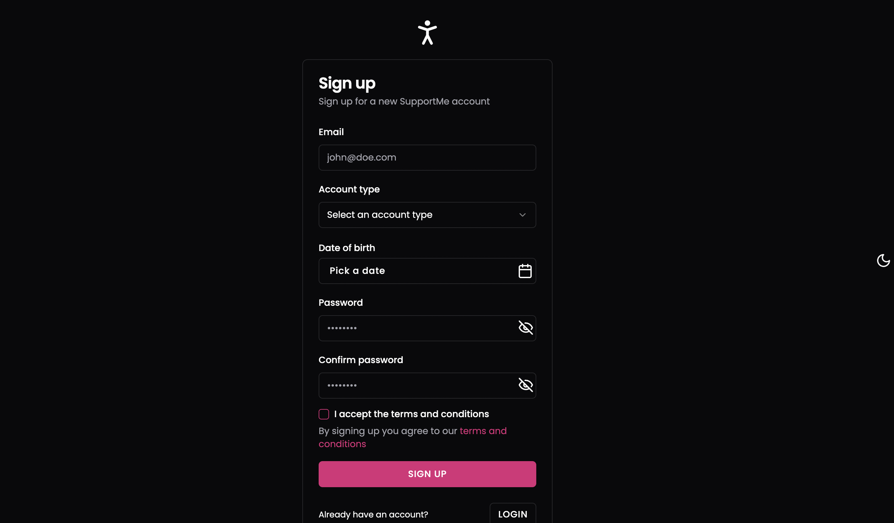
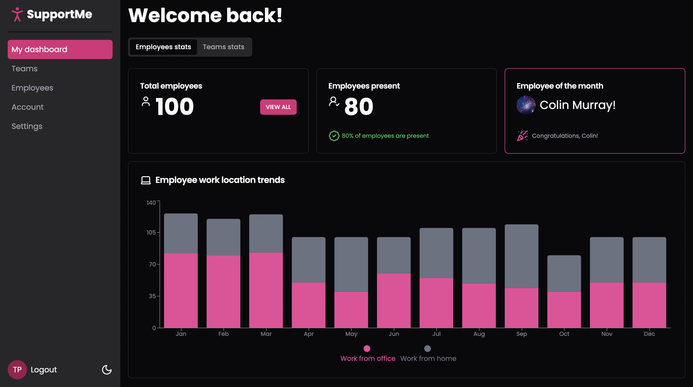

# Support-dashboard 

[DEPLOYED VERSION](https://vanyadev-support-dashboard.vercel.app/)

## Stack

- **Framework**: Next.js 15
- **UI Components**: shadcn/ui
- **Styling**: Tailwind CSS
- **Charts**: Recharts
- **Icons**: Lucide React

## Overview

SupportMe is a demonstration project showcasing the implementation and styling capabilities of shadcn/ui components within a Next.js application. It's structured as an employee dashboard to provide practical context for component usage.





### Installation

```bash
# Clone the repository
git clone https://github.com/yourusername/support-me.git

# Install dependencies
npm install 

# Run the development server
npm run dev
```
Then open [http://localhost:3000](http://localhost:3000) to view the local development server.

## Routes

```
/login
/sign-up
/dashboard
  /account
  /employees
  /settings
  /teams
```

## Structure

```
src/
├── app/
│   ├── (logged-out)/     # Login/Signup component examples
│   ├── dashboard/        # Main component showcase
│   └── layout.tsx        # Root layout with theming
├── components/           
│   └── ui/               # shadcn/ui components
└── lib/                  # Utilities
```
